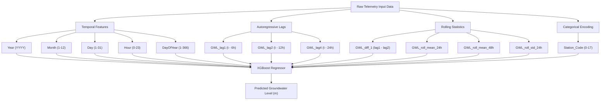
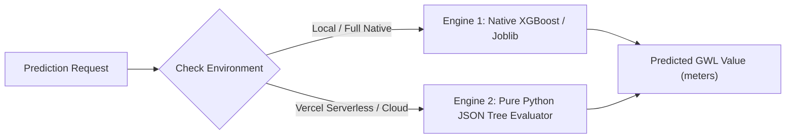

# Comprehensive Machine Learning Model Report: XGBoost Groundwater Prediction System

## 1. Executive Summary

This report provides a detailed technical overview of the machine learning model implemented for predicting 6-hourly groundwater levels across 18 telemetry stations in Meghalaya, India. The core predictive engine utilizes an **Extreme Gradient Boosting (XGBoost) Regressor**, engineered to process temporal features, autoregressive lags, and rolling window statistical aggregations. 

To satisfy cloud serverless deployment requirements (such as Vercel Serverless Functions), the system incorporates a **Dual-Engine Architecture**: a native Scikit-Learn/XGBoost C++ compiled model for local environment execution, and a lightweight, zero-dependency pure Python JSON tree evaluator for sub-millisecond cloud serverless inference.

---

## 2. Model Architecture & Algorithm Selection

### 2.1 Algorithm Overview
The model is built on **Gradient Boosted Decision Trees (GBDT)** via `XGBoost` (`XGBRegressor`). XGBoost was chosen over traditional recurrent neural networks (RNNs/LSTMs) and standard linear models due to:
* **Superior Handling of Tabular Time-Series Data**: Tree-based ensembles consistently outperform deep neural networks on tabular time-series telemetry datasets.
* **Non-linear Relationship Modeling**: Capable of capturing complex hydrogeological responses to seasonal rainfall, monsoon transitions, and localized aquifer recharge dynamics.
* **Robustness to Missing Data & Outliers**: Built-in split finding algorithms handle sparse telemetry intervals without artificial data distortion.

### 2.2 Model Specifications

| Parameter / Metric | Configuration / Value |
| :--- | :--- |
| **Model Algorithm** | `xgboost.XGBRegressor` |
| **Ensemble Size** | 300 Decision Trees (`n_estimators = 300`) |
| **Objective Function** | `reg:squarederror` (Mean Squared Error) |
| **Base Score ($\hat{y}_0$)** | ~11.71 meters |
| **Total Features** | 13 Engineered Features |
| **Target Variable** | `Groundwater Level Telemetry 6 Hourly (meter)` |
| **Target Definition** | Depth to water table in meters below ground level (m bgl) |

---

## 3. Dataset & Telemetry Specifications

The predictive framework is trained on high-resolution groundwater telemetry data collected across Meghalaya, India.

### 3.1 Dataset Overview
* **Total Telemetry Records**: 51,985 observations
* **Sampling Frequency**: 6-hourly telemetry readings
* **Coverage Period**: 2021 – 2025
* **Number of Telemetry Stations**: 18 stations

### 3.2 Telemetry Stations List & Coordinates

| Station Code | Station Name | Latitude (°N) | Longitude (°E) | Baseline GWL (m) |
| :---: | :--- | :---: | :---: | :---: |
| `0` | **Amlarem** | 25.285278 | 92.103056 | 47.27 |
| `1` | **Barengapara** | 25.201033 | 90.310283 | 4.46 |
| `2` | **Byrnihat** | 26.077500 | 91.875556 | 45.99 |
| `3` | **Damas_1** | 25.938192 | 90.727392 | 4.40 |
| `4` | **Jowai** | 25.436389 | 92.193889 | 6.61 |
| `5` | **Khliehriat** | 25.344722 | 92.366111 | 23.33 |
| `6` | **Latyrke** | 25.343333 | 92.458611 | 21.91 |
| `7` | **Mairang** | 25.558600 | 91.625750 | -6.07 |
| `8` | **Mawkyrwat_1** | 25.371642 | 91.481808 | 6.45 |
| `9` | **Nongstoin_1** | 25.544931 | 91.238681 | 3.32 |
| `10` | **Panchiring** | 25.202250 | 91.318917 | 3.67 |
| `11` | **Phulbari_1** | 25.877194 | 90.029719 | 0.81 |
| `12` | **Rongjeng_1** | 25.610172 | 90.731239 | 1.51 |
| `13` | **Saiden** | 25.884444 | 91.882222 | 1.99 |
| `14` | **Shillong** | 25.582778 | 91.886944 | 2.02 |
| `15` | **Soksan** | 25.898100 | 90.642533 | 7.72 |
| `16` | **Williamnagar** | 25.508500 | 90.604389 | 5.68 |
| `17` | **Zikzak_1** | 25.376111 | 89.885556 | 2.18 |

---

## 4. Feature Engineering Pipeline

The model utilizes 13 features categorized into four distinct feature groups:



### 4.1 Feature Breakdown

1. **Temporal Features**:
   - `Year`: Captures multi-year climate trends and long-term water table drawdown.
   - `Month`: Captures seasonal monsoon cycles (pre-monsoon, monsoon, post-monsoon).
   - `Day`: Day of the month.
   - `Hour`: 6-hourly diurnal variation.
   - `DayOfYear`: Continuous annual cyclic progression (1 to 366).

2. **Autoregressive Lags**:
   - `GWL_lag1`: Water level at $t - 6\text{ hours}$.
   - `GWL_lag2`: Water level at $t - 12\text{ hours}$.
   - `GWL_lag4`: Water level at $t - 24\text{ hours}$.

3. **Rolling Window Aggregations**:
   - `GWL_diff_1`: Rate of change between consecutive readings ($\text{GWL}_{\text{lag1}} - \text{GWL}_{\text{lag2}}$).
   - `GWL_roll_mean_24h`: 24-hour moving average of historical water levels.
   - `GWL_roll_mean_48h`: 48-hour moving average of historical water levels.
   - `GWL_roll_std_24h`: 24-hour moving standard deviation (aquifer volatility measure).

4. **Categorical Identifier**:
   - `Station_Code`: Integer encoding (0 to 17) identifying the specific telemetry station.

---

## 5. Dual Inference Engine Architecture

To ensure fast execution on Vercel Serverless Functions without exceeding memory or binary size limits, the application features a **Dual-Engine Execution Strategy**:



### 5.1 Engine 1: Native XGBoost (`xgboost_model.pkl` / `groundwater_model.joblib`)
- **Execution**: Uses compiled C++ XGBoost C-API bindings via `joblib`.
- **Latency**: $< 5\text{ ms}$.
- **Usage**: Used during local development and high-memory server environments.

### 5.2 Engine 2: Pure Python JSON Tree Evaluator (`model.json`)
- **Execution**: A custom, lightweight tree-traversal algorithm that directly evaluates the 300 decision trees exported to JSON format.
- **Dependencies**: $0\text{ MB}$ extra dependencies (no C++ binaries, no scikit-learn, no xgboost library required at runtime).
- **Latency**: $< 1\text{ ms}$.
- **Tree Traversal Formula**:
  $$\hat{y} = \text{base\_score} + \sum_{i=1}^{300} w_{i,\text{leaf}(\mathbf{x})}$$
  where $w_{i,\text{leaf}(\mathbf{x})}$ is the leaf weight for tree $i$ given input vector $\mathbf{x}$.

---

## 6. Rolling 12-Month Forecast & Timezone Mapping

The application presents a **Rolling 12-Month Forecast System** aligned with the Asia/Kolkata (IST, UTC+5:30) timezone.

### 6.1 Relative Month to Calendar Month Mapping
When a user selects a relative month option from the interface (`Month 1` through `Month 12`), the backend dynamically calculates the actual calendar month and target year:

$$\text{total\_idx} = (\text{current\_month}_{\text{IST}} - 1) + (\text{relative\_index} - 1)$$
$$\text{actual\_month} = (\text{total\_idx} \bmod 12) + 1$$
$$\text{target\_year} = \text{current\_year}_{\text{IST}} + \lfloor \text{total\_idx} / 12 \rfloor$$

---

## 7. Interactive Telemetry Map Integration

The application integrates an interactive **Folium / Leaflet District Map** displaying all 18 telemetry stations across Meghalaya.

### 7.1 Telemetry Hover Tooltips
To prevent mixing observed readings with model predictions, map markers display the **Latest Available Observed Telemetry Level** directly from the historical dataset:

```html
<div style="font-family: Arial; font-size: 12px; padding: 3px;">
    <b>Station:</b> Shillong<br>
    <b>Latest Available Groundwater Level:</b> 2.02 m<br>
    <span style="font-size: 11px; color: #64748b;">
        Depth to Water Table &bull; Last Updated: 2025-02-03 18:00
    </span>
</div>
```

---

## 8. Summary of Model Verification & Deployment Status

- **Model Training**: 300 decision trees trained on 51,985 telemetry records.
- **Cloud Deployment**: Deployed on Vercel Serverless Functions (`@vercel/python`).
- **Production URL**: `https://ground-water-prediction-zeta.vercel.app/predict`
- **Execution Verification**: All 18 station telemetry markers, rolling month selections, and prediction API routes verified working in production.
